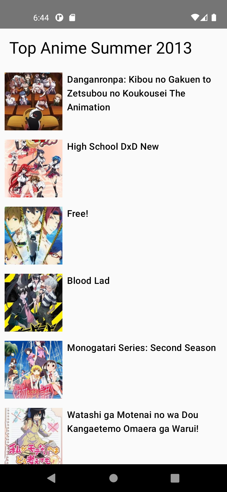

# Anime App
Anime App compose code

/*
README.md Overview:

- This app contains two screens : One for displaying a list of Anime which fetched from a public API and 
 other for showing the details of selected Anime item.
- This is a modular MVVM clean architecture app that implements a structured and scalable approach using multiple
  modules, ensuring maintainability, testability, and separation of concerns.
- App uses Modularization, Hilt, Coroutines, Flow, Unit Tests, Error Handling
- Modules: app,common, data, domain
- Made Use of public API to display list and detail page
- Folder Structure
- App Module
  - navigation: Manages screen navigation (AppNavigation).
  - screen: Screens for the app:
      - Anim ListScreen: Displays Animals list.
      - Anim DetailScreen: Displays selected Animal details.
  - viewmodel: MainViewModel holds business logic.
  - MainActivity: App entry point.
  - MyApplication: Initializes the app. Core Module
  - ui Theme: defines color, theme of app
- Common Module
  - Constant of app
  - API response resource class
- Data Module
  - di
     - AppModule provides global dependencies.
     - CoreModule provides core dependencies. 
  - mapper: Maps ItemDto to domain models.
  - remote : Contains API and Anime repository calls.
  - repository: Anime Repository fetches API Calls.ApiService for API calls, Base Response for API responses.
- Domain Module
  - model: Defines domain model Item.
  - util: Common utilities.
  - useCase : Anim repository call
  - repository: Interface of AnimList for fetching data
- Screenshots: [Attach screenshots of AnimeList and AnimeDetail screens here]
*/

